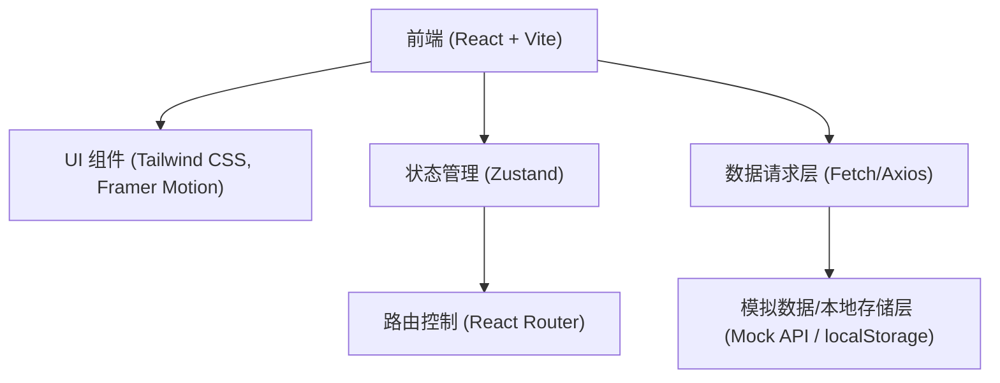
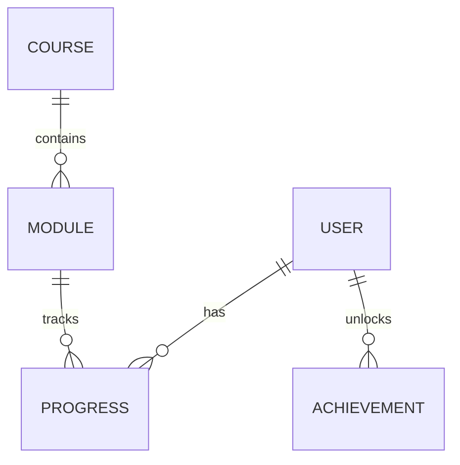

## 1. 架构设计



## 2. 技术说明
- 前端框架：React@18 + Vite
- 样式方案：Tailwind CSS@3 + Lucide React (图标)
- 动画库：Framer Motion (用于平滑的页面过渡和微交互)
- 状态管理：Zustand (轻量级状态管理)
- 路由：React Router DOM
- 图表库：Recharts (用于学习进度追踪数据可视化)
- 交互与样式扩展：clsx, tailwind-merge (方便管理Tailwind类名)

## 3. 路由定义
| 路由 | 目的 |
|-------|---------|
| / | 落地页 (Landing Page)，未登录展示介绍 |
| /login | 注册/登录页面 |
| /dashboard | 个人仪表盘 (学习进度、推荐路径) |
| /courses | 分级课程体系中心 |
| /learn/:courseId | 互动式学习模块 (沉浸式练习界面) |
| /community | 社区交流及成就激励系统 |

## 4. API 定义 (前端模拟接口定义)
由于当前主要为前端实现，以下为预期的数据结构接口定义：

```typescript
interface UserProfile {
  id: string;
  name: string;
  level: string; // e.g., 'B1'
  xp: number;
  streak: number; // 连续学习天数
  avatar: string;
}

interface Course {
  id: string;
  title: string;
  level: string;
  description: string;
  progress: number; // 0-100
  thumbnail: string;
  tags: string[];
}

interface ChatMessage {
  id: string;
  role: 'user' | 'ai';
  content: string;
  corrections?: string[]; // AI给出的纠正建议
}
```

## 5. 数据模型设计
### 5.1 数据模型关系

