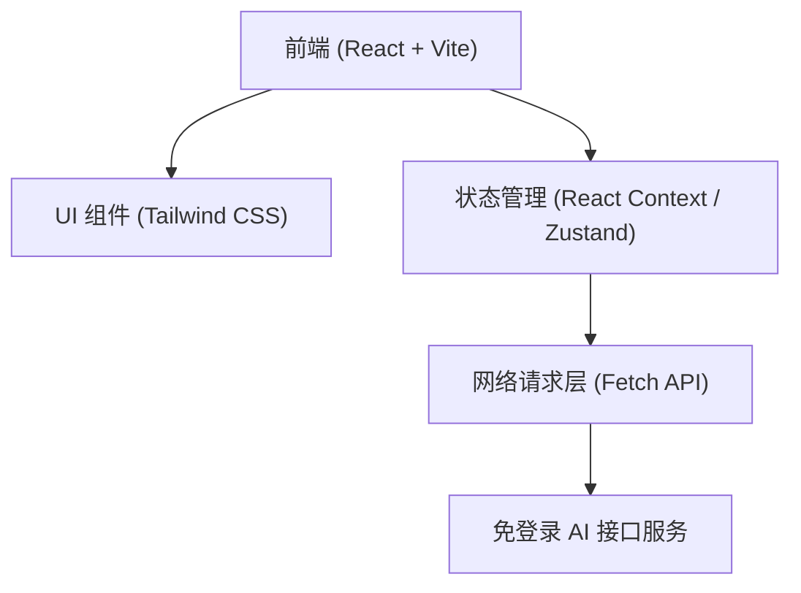

## 1. 架构设计



## 2. 技术说明
- 前端框架：React@18 + Vite
- 样式方案：Tailwind CSS@3 + Lucide React (图标)
- 渲染库：react-markdown (Markdown 支持), react-syntax-highlighter (代码高亮)
- 请求工具：原生 Fetch API (支持处理 ReadableStream 以实现流式对话)
- 本地存储：localStorage (保存历史记录和主题偏好)

## 3. 路由定义
| 路由 | 目的 |
|-------|---------|
| / | 对话主页 |

## 4. API 定义
该应用将直接在前端调用支持跨域（CORS）且免登录的第三方公共/测试大模型API，格式采用类 OpenAI 格式。

```typescript
interface ChatMessage {
  role: 'user' | 'assistant' | 'system';
  content: string;
}

interface ChatRequest {
  messages: ChatMessage[];
  stream?: boolean;
}

interface ChatResponse {
  choices: Array<{
    message?: { content: string };
    delta?: { content: string }; // 用于流式传输
  }>;
}
```