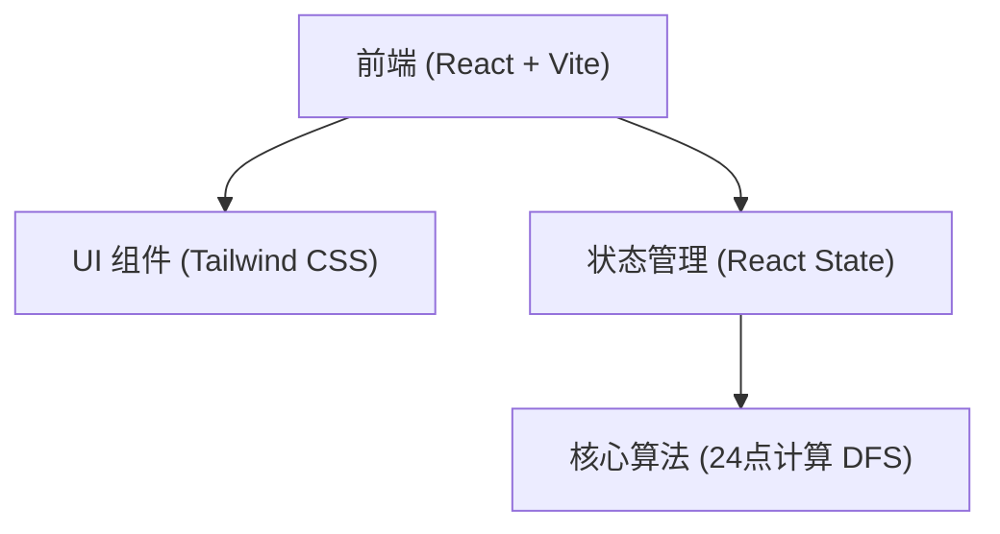

## 1. 架构设计


## 2. 技术说明
- 前端框架：React@18 + Vite
- 样式方案：Tailwind CSS@3 + Lucide React (图标)
- 初始化工具：vite-init (react-ts)
- 核心算法：基于深度优先搜索(DFS)穷举所有可能的四则运算组合，支持括号。

## 3. 路由定义
| 路由 | 目的 |
|-------|---------|
| / | 24点计算器主页 |

## 4. 数据结构
```typescript
interface CalculateResult {
  expressions: string[]; // 所有计算出24的算式
  hasSolution: boolean;  // 是否有解
}
```