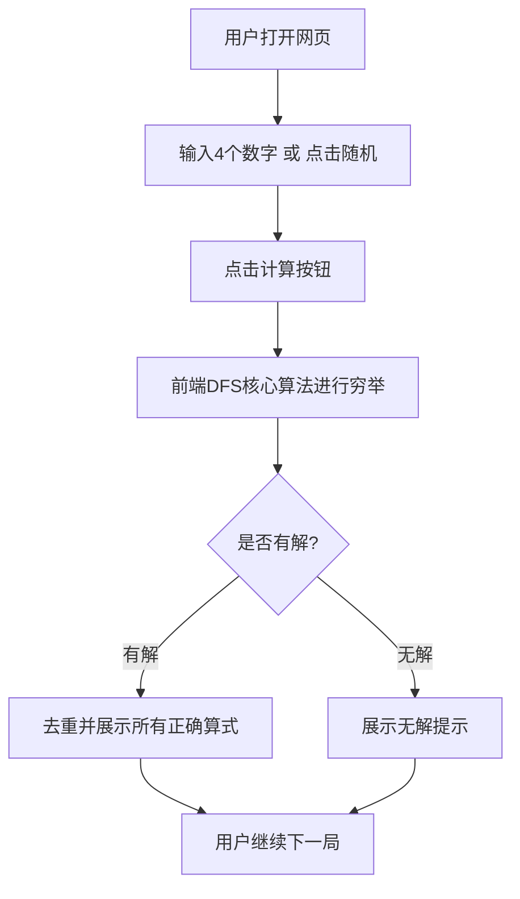

## 1. 产品概述
一款简洁、易用的24点计算工具。用户可以输入4个数字，工具将自动计算并展示所有能得出24的数学算式。主要用于辅助24点扑克牌游戏、数学逻辑训练及益智娱乐场景。

## 2. 核心功能

### 2.1 核心模块
1. **输入与操作区**：提供4个数字输入框，支持手动输入或随机生成数字。
2. **结果展示区**：展示所有计算成功的算式，若无解则提供友好的无解提示。

### 2.2 页面详情
| 页面名称 | 模块名称 | 功能描述 |
|-----------|-------------|---------------------|
| 首页 | 数字输入区 | 4个类似扑克牌样式的输入框，限制输入1-13的数字 |
| 首页 | 操作按钮区 | 提供“计算24点”、“随机发牌”、“清空”三个主要操作按钮 |
| 首页 | 结果展示区 | 以列表或网格形式展示所有计算结果（去重后），若无解则显示“无解”提示 |

## 3. 核心流程
用户在4个输入框中输入数字（或点击随机发牌） -> 点击“计算24点” -> 前端算法穷举数字和运算符的组合 -> 过滤结果等于24的表达式 -> 去除重复算式 -> 在界面展示计算结果。

## 4. 界面设计
### 4.1 设计风格
- **拟物与现代结合**：输入框采用类似扑克牌的卡片设计，增加趣味性。
- **色彩搭配**：背景采用高级的浅色/深色主题（支持自动适配），主按钮使用突出的强调色（如活力橙或深邃蓝）。
- **交互动画**：点击计算时有轻微的加载动画，算式列表采用平滑展开的动画效果，提升质感。

### 4.2 页面设计概览
| 页面名称 | 模块名称 | UI 元素 |
|-----------|-------------|-------------|
| 首页 | 顶部标题 | 优雅的Typography，带有图标的Logo区 |
| 首页 | 扑克牌输入区 | 4张并排的白色卡片，带有圆角和轻微阴影，悬浮时有交互反馈 |
| 首页 | 结果面板 | 毛玻璃效果（backdrop-blur）的卡片容器，内部采用小药丸(badge)或列表展示算式 |

### 4.3 响应式设计
- 桌面端优先，大屏幕下扑克牌水平居中排列。
- 移动端自适应，在小屏幕上扑克牌可以2x2网格排列，确保触摸区域足够大，方便移动端输入。
