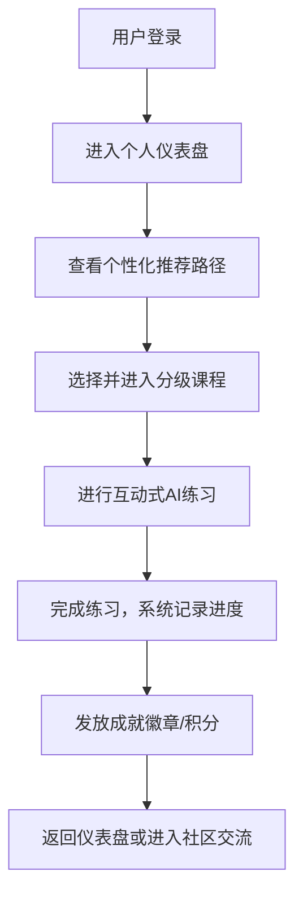

## 1. 产品概述
一款专注于沉浸式语言学习的AI在线教育平台，通过智能推荐和互动式模块，为用户提供个性化、高效的学习体验。
- 核心目标是帮助语言学习者突破口语和听力障碍，提供系统化的分级课程，并通过社区互动和成就激励保持学习动力。

## 2. 核心功能

### 2.1 用户角色
| 角色 | 注册方式 | 核心权限 |
|------|----------|----------|
| 游客 | 无 | 浏览平台介绍、部分免费试听课程 |
| 注册用户 | 邮箱/手机号注册 | 完整课程学习、进度追踪、社区互动、AI对话练习 |

### 2.2 功能模块
1. **主页/仪表盘**：展示个性化学习路径、近期学习进度和成就概览。
2. **课程中心**：分级课程体系浏览，支持按难度、主题筛选。
3. **互动学习室**：AI语音对话、情景模拟练习。
4. **社区与成就**：学习排行榜、动态分享、成就徽章展示。
5. **个人中心**：账号设置、详细学习数据统计、学习历史。

### 2.3 页面详情
| 页面名称 | 模块名称 | 功能描述 |
|----------|----------|----------|
| 仪表盘 | 学习进度追踪 | 展示当前课程进度、本周学习时长图表 |
| 仪表盘 | 个性化推荐 | 基于用户水平推荐的下一个学习模块或练习 |
| 课程中心 | 分级课程列表 | 按照A1-C2等标准划分的课程卡片 |
| 互动学习室 | AI对话模块 | 实时文字/语音对话界面，AI即时反馈与语法纠错 |
| 社区中心 | 讨论区与排行榜 | 用户发帖交流，展示积分排行榜和最新解锁成就 |

## 3. 核心流程
用户登录后进入仪表盘，查看今日推荐任务，进入互动学习室进行沉浸式对话练习，完成后获得积分和成就，并在社区中与他人交流。

## 4. 界面设计
### 4.1 设计风格
- 现代、科技感与亲和力并存的沉浸式设计（Modern, Immersive, Friendly）
- 主色调：充满活力的品牌色（如电光蓝搭配薄荷绿或活力橙），传达智能与成长的概念
- 按钮样式：圆润的微立体按钮，带有柔和的悬浮发光效果
- 字体：使用干净、易读的无衬线字体，标题使用更具个性的现代字体
- 布局风格：卡片式布局结合大面积留白，侧边栏导航，突出内容本身
- 图标风格：双色线性图标，配合平滑微交互动画

### 4.2 页面设计概览
| 页面名称 | 模块名称 | UI 元素 |
|----------|----------|---------|
| 仪表盘 | 进度卡片 | 环形进度条、渐变背景色、粗体数字统计 |
| 互动学习室 | 对话界面 | 动态声波可视化（如有）、气泡式对话框、磨砂玻璃背景 |
| 社区中心 | 排行榜 | 列表带有前三名特殊皇冠图标标识、用户头像带等级边框 |

### 4.3 响应式设计
桌面端优先，移动端自适应。移动端采用底部导航栏，互动学习室在移动端优化为全屏沉浸模式，确保操作按钮易于触达。