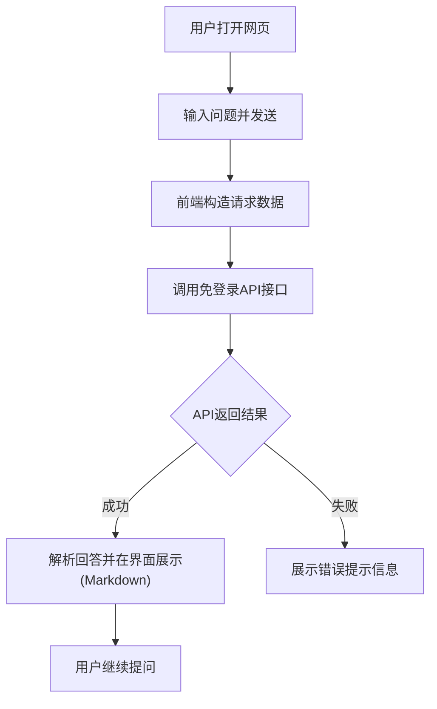

## 1. 产品概述
一款无需登录、完全免费的AI问答工具，通过调用API接口获取AI回答，支持全平台（PC、移动端）访问。主要解决用户随时随地快速获取AI解答的需求。

## 2. 核心功能

### 2.1 核心模块
1. **首页/对话页**：主页面，包含聊天界面、输入框、发送按钮、清空历史等功能。
2. **设置模块**（可选）：主题切换（深色/浅色），API配置（默认使用内置免费接口）。

### 2.2 页面详情
| 页面名称 | 模块名称 | 功能描述 |
|----------|----------|----------|
| 对话主页 | 聊天列表 | 展示用户与AI的对话记录，支持Markdown渲染及代码高亮 |
| 对话主页 | 输入区域 | 多行输入框，支持回车发送，包含发送按钮和清空上下文按钮 |
| 对话主页 | 顶部导航 | 显示应用名称、主题切换按钮 |

## 3. 核心流程
用户输入问题 -> 点击发送 -> 前端调用免登录API获取AI回答 -> 实时展示回答（支持流式输出）

## 4. 界面设计
### 4.1 设计风格
- 极简、现代风（Minimalist, Modern）
- 响应式布局（适配手机端、平板、PC）
- 颜色：深色模式自动适配，主色调使用优雅的蓝色或品牌色。
- 交互：平滑的滚动动画，输入框自动撑高，发送状态加载动画。

### 4.2 页面设计概览
| 页面名称 | 模块名称 | UI 元素 |
|----------|----------|---------|
| 对话主页 | 聊天区 | 气泡样式（区分用户与AI），带有阴影和圆角 |
| 对话主页 | 输入区 | 悬浮式底部输入框，带有磨砂玻璃效果（backdrop-blur） |

### 4.3 响应式设计
桌面端优先，移动端自适应，优化触摸体验（较大的点击区域）。